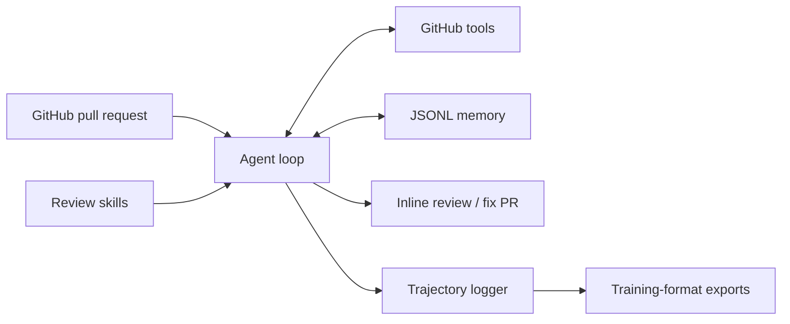

# LLM Code Review Agent

A Python agent for GitHub pull-request review, with modular review instructions,
persistent repository memory, and tool-use trajectory collection.

## Features

- **Automated PR review:** triage pull requests, inspect diffs and source files,
  submit inline review comments, and create fix PRs through 11 GitHub tools.
- **Persistent memory:** six memory tools track developer profiles, repository
  issue patterns, and false-positive records across reviews.
- **Trajectory exports:** record model responses, tool calls, results, and usage
  in JSONL; export native tool-calling SFT records, tool-supervision records,
  and heuristic preference-pair candidates.
- **Evaluation framework:** compare a single-call baseline, the original agent,
  and an execution-assisted review configuration on paired buggy and clean fixtures.

## Architecture

The review workflow follows **Triage → Analyze → Review → Act**.



The evaluation runner adds a staged **context → execution → submission →
finalization** workflow. Its execution tool runs bounded examples against audited
fixture functions; it is separate from the GitHub review CLI.

## Setup

Use Python 3.12 and keep the checkout directory named `code_review_agent`.

```bash
git clone https://github.com/Jiongran-Wang/code_review_agent.git code_review_agent
cd code_review_agent
python3.12 -m venv .venv
.venv/bin/python -m pip install -r requirements.txt
```

For GitHub reviews, set `OPENAI_API_KEY` and `GITHUB_TOKEN` in your shell.
`OPENAI_MODEL` optionally selects the model; the CLI defaults to `gpt-4o`.
Environment variables are read directly; `.env` files are not loaded automatically.

## Usage

### Review a pull request

```bash
.venv/bin/python cli.py review owner/repo 42 --model gpt-4o-mini --dry-run
```

Dry-run skips GitHub writes while allowing model calls and local memory updates.
Remove `--dry-run` to enable review submission and fix-PR operations. Model calls
consume API usage. Memory is stored in `~/.claude/review_memory.jsonl`.

### Inspect and export trajectories

```bash
.venv/bin/python cli.py inspect trajectories/trace_SESSION_ID.jsonl
.venv/bin/python cli.py export --input trajectories --output exports \
  --format sft tool-supervision
.venv/bin/python cli.py health-report --repo owner/repo --output report.md
```

Trajectory exports are training-data formats; the project does not include a
fine-tuned model. Traces from private repositories should remain private.

### Run an offline example

```bash
.venv/bin/python -m evaluation.run \
  --backend scripted --systems baseline agent agent-verified \
  --verification-version v3 --max-iterations 8 \
  --output evaluation/runs/local-smoke
```

This exercises all three workflows without API credentials. Use a fresh output
directory for each run. Scripted responses test workflow behavior, not model quality.

## Evaluation

The published GPT-4o-mini comparison contains **48 reviews across 16 synthetic
fixtures and three configurations**. It measures defect precision, recall, F1,
clean-case false alarms, workflow completion, and token usage. Scores are
assistant-adjudicated development results; independent human validation is pending.

- [Results and failure analysis](evaluation/published/full-comparison-v3/comparison.md)
- [Dataset, execution, and scoring](evaluation/README.md)
- [Published artifacts and score reproduction](evaluation/published/full-comparison-v3/README.md)

## Tests

```bash
.venv/bin/python test_all.py
.venv/bin/python -m unittest discover -s evaluation -p 'test_*.py'
.venv/bin/python evaluation/validate_dataset.py
.venv/bin/python scripts/verify_published_results.py
```

These checks use local fixtures and mocks, without API calls. They also run in
GitHub Actions.

## Project structure

| Directory | Purpose |
|---|---|
| `agent/` | LLM client, agent loop, skill loading, tool routing |
| `tools/` | GitHub operations and persistent memory |
| `skills/` | Review instructions and references |
| `trajectory/` | Trace recording and dataset exporters |
| `pipeline/` | Single-PR and batch orchestration |
| `evaluation/` | Fixtures, execution tools, scoring, tests, and results |
| `scripts/` | Offline verification of published results |
