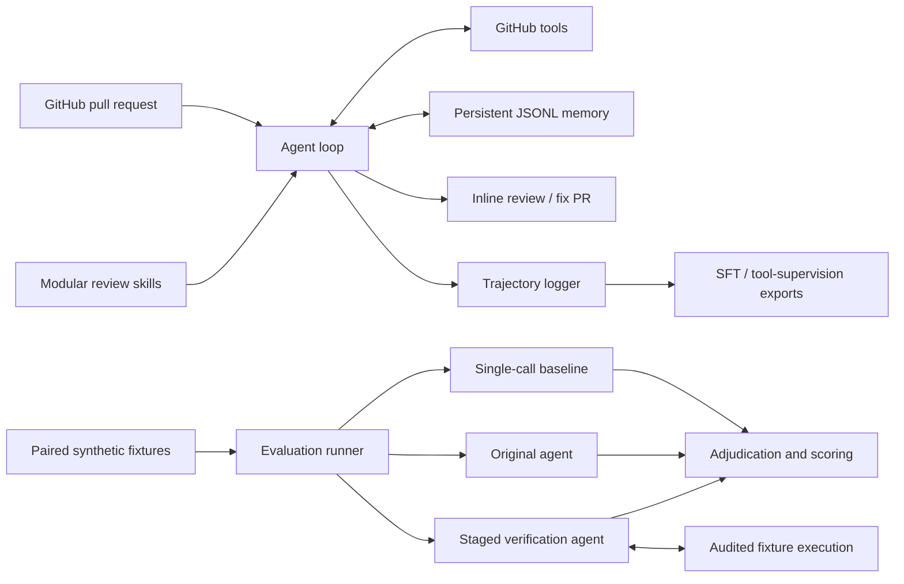

# LLM Code Review Agent

A Python agent that reviews GitHub pull requests, records its tool-use trajectories,
and evaluates review quality against paired buggy and clean code changes.

The project combines a working GitHub review workflow with a reproducible,
execution-assisted development evaluation. It explores a practical question:
**can an agent use code execution to improve defect detection without producing
unsupported review comments?**

## What it does

- **Tool-driven reviews:** 11 GitHub tools and 6 memory tools support PR triage,
  diff and source inspection, inline review submission, and fix-PR creation.
- **Cross-PR memory:** persistent developer profiles, repository issue patterns,
  and false-positive records; a CLI command generates repository health reports.
- **Trajectory collection:** JSONL records capture model responses, tool calls,
  results, and usage. Exporters produce native tool-calling SFT records,
  tool-supervision records, and heuristic preference-pair candidates.
- **Controlled evaluation:** a single-call baseline, original agent, and staged
  verification agent review the same 16 synthetic PR fixtures. The verified
  configuration executes bounded examples against audited fixture functions.

No model fine-tuning was performed. Preference-pair exports are heuristic candidates,
not validated preference labels. Automated fix correctness and memory benefits
have not been measured in the reported comparison.

## Architecture



The GitHub workflow follows **Triage → Analyze → Review → Act**. The evaluation's
v3 configuration uses **context → execution → submission → finalization**, with
compact prompts in later stages. Execution support is specific to the evaluation
fixtures; the production GitHub CLI does not execute arbitrary PR code.

## Measured development results

**GPT-4o-mini · 16 fixtures · 8 defect/clean pairs · 3 configurations · 48 reviews**

These are **assistant-adjudicated development results**, with one sample per case
and system. The assistant-authored synthetic fixtures informed development;
they are not a held-out benchmark. Independent human validation is pending.

| Metric | Single-call baseline | Original agent | Verification agent v3 |
|---|---:|---:|---:|
| Strict precision | 33.3% | 50.0% | 50.0% |
| Strict recall | 62.5% | 50.0% | 87.5% |
| Strict F1 | 43.5% | 50.0% | 63.6% |
| Required workflows completed | 16/16 | 15/16 | 15/16 |
| Completed clean cases falsely flagged | 5/8 | 2/7 | 5/7 |
| Input tokens | 261,603 | 995,289 | 606,880 |
| Model responses | 16 | 57 | 62 |

Compared with the original agent, v3 increased strict F1 by **13.6 percentage
points** and used **39.0% fewer input tokens**, while increasing clean-case false
alarms. It made more calls and took longer. The configurations differ in prompts,
tools, and compute, so the comparison does not isolate the effect of execution.

Scoring sensitivity matters: under a separate cause-only matching rule, F1 is
**60.9% / 75.0% / 72.7%** for baseline / original / v3. This reverses the ranking
between the two agents. Strict matching requires both the introduced cause and
a correct, concrete consequence within the fixture's contract.

See the [full results and failure analysis](evaluation/published/full-comparison-v3/comparison.md),
[auditable run artifacts](evaluation/published/full-comparison-v3/README.md), and
[frozen scoring policy](evaluation/scoring-policy-v1.md).

## Quick start: no API key required

Use **Python 3.12**. Keep the checkout directory named `code_review_agent` because
the current source imports the root directory as a Python package.

```bash
git clone https://github.com/Jiongran-Wang/code_review_agent.git code_review_agent
cd code_review_agent
python3.12 -m venv .venv
.venv/bin/python -m pip install -r requirements.txt

# Check all authored base/head/reference fixture expectations.
.venv/bin/python evaluation/validate_dataset.py

# Exercise all three workflows with scripted responses, without API calls.
.venv/bin/python -m evaluation.run \
  --backend scripted --systems baseline agent agent-verified \
  --verification-version v3 --max-iterations 8 \
  --output evaluation/runs/local-smoke
```

Use a fresh output directory each time. Scripted runs test the plumbing and
output contracts; they do **not** measure model quality.

### Review a GitHub PR

Set `OPENAI_API_KEY` and `GITHUB_TOKEN` in your local shell. `OPENAI_MODEL` is
optional; the CLI defaults to `gpt-4o`, while the reported evaluation uses
`gpt-4o-mini`. The application reads environment variables and does not load
`.env` files automatically.

```bash
.venv/bin/python cli.py review owner/repo 42 --model gpt-4o-mini --dry-run
```

Dry-run skips GitHub writes but still reads the PR, calls the model, and may
update local memory. Remove `--dry-run` to allow review comments and fix-PR
operations. API inference incurs provider usage. Review trajectories can contain
repository source and should be kept private when reviewing private repositories.

Memory is stored at `~/.claude/review_memory.jsonl` for historical compatibility.
Some internal configuration names retain `ANTHROPIC_` prefixes, but credentials
are read from `OPENAI_API_KEY` and inference uses the OpenAI client.

### Export and inspect trajectories

```bash
.venv/bin/python cli.py inspect trajectories/trace_SESSION_ID.jsonl
.venv/bin/python cli.py export --input trajectories --output exports \
  --format sft tool-supervision
.venv/bin/python cli.py health-report --repo owner/repo --output report.md
```

### Reproduce the comparison

Recompute the published strict and sensitivity scores **without API calls**:

```bash
.venv/bin/python scripts/verify_published_results.py
```

To collect a **new paid model run**, use the frozen launcher. It checks the
original source/fixture hashes and prompts for the API key without echoing it:

```bash
bash evaluation/run_full_comparison_v3.sh evaluation/runs/my-full-comparison
```

The launcher schedules 48 reviews with rate-limit pacing. Re-running it does not
guarantee identical model outputs. See [evaluation instructions](evaluation/README.md)
and the [experiment specification](evaluation/full-comparison-v3.md) for settings.

## Tests

```bash
.venv/bin/python test_all.py
.venv/bin/python -m unittest discover -s evaluation -p 'test_*.py'
.venv/bin/python evaluation/validate_dataset.py
.venv/bin/python scripts/verify_published_results.py
```

The test suite uses mocks and local fixtures; it needs no API credentials. Fixture
validation uses subprocesses, not a security sandbox. The execution tool only
accepts audited, hash-registered fixture sources and bounded arguments.

## Repository guide

| Directory | Purpose |
|---|---|
| `agent/` | LLM adapter, iterative runner, skill loader, tool routing |
| `tools/` | GitHub operations and persistent memory |
| `skills/` | Modular review instructions and references |
| `trajectory/` | JSONL recording and training-format exporters |
| `pipeline/` | Single-PR and batch orchestration |
| `evaluation/` | Fixtures, execution tools, scoring, tests, experiment versions |
| `evaluation/published/` | Reviewed publication copies of the completed experiment |
| `scripts/` | Offline verification of published results |

An additional [16-case candidate set](evaluation/candidate_sets/generalization-v1/README.md)
has reference checks but **has not been evaluated by the model** or admitted to
the execution allowlist. It is excluded from every result above. Next work should
prioritize independent label review, new cases, and rejection of unsupported
claims when base/head execution agrees.
