# Code Review Agent evaluation pilot

This folder contains a runnable dataset, an offline adapter for the existing
AgentRunner, a single-call baseline, and an adjudication/scoring workflow.
The adapter makes no GitHub network calls. Model inference is a separate,
explicit `--backend live` operation. The completed GPT-4o-mini comparison covers 48 live reviews across three systems.
See [published results](published/full-comparison-v3/comparison.md) and
[offline reproduction](published/full-comparison-v3/README.md). Scores are
assistant-adjudicated development results, not independently human-validated.

## Run an experiment

Use Python 3.12 and create `.venv` with `python3.12 -m venv .venv`, then
install `requirements.txt`. Keep the checkout directory named `code_review_agent`.

First exercise the entire workflow without a model or API key:

```bash
.venv/bin/python -m evaluation.run \
  --backend scripted --systems baseline agent \
  --output evaluation/runs/my-smoke
```

The scripted client deliberately makes **no defect judgments**. It checks the
agent loop, tools, recording and output format. Its results are visibly marked
as scripted, and the adjudication command refuses to score them as model results.

For a small live pilot, configure OPENAI_API_KEY locally in the launching
terminal's environment, then run:

```bash
.venv/bin/python -m evaluation.run \
  --backend live --model gpt-4o-mini --systems baseline agent \
  --limit 2 --repeats 1 --max-iterations 8 \
  --max-output-tokens 2048 --temperature 0 \
  --output evaluation/runs/gpt4o-pilot
```

Alternatively, add `--prompt-api-key` to enter a key at a hidden prompt. Paste
the full secret key without quotes, then press Enter. The key is used for that
process only and is not saved in manifests or artifacts. This overrides a stale
OPENAI_API_KEY value without changing the parent terminal's environment.

On `AuthenticationError`, the runner prints the error and stops the batch.
Remaining cases are recorded as not run, and an auth-only failure is not marked
as a model evaluation. Re-enter an active key from the API dashboard and retry
with a new output directory, such as `evaluation/runs/gpt4o-pilot-v2`.

For an ambiguous `RateLimitError`, diagnose with one tiny inference request:

```bash
.venv/bin/python -m evaluation.api_diagnostics
```

The command prompts for the key and prints only allowlisted error codes/types,
HTTP status, validated rate-limit/reset headers, and numeric limit/used/requested
measurements when supplied by the API. It does not print raw API messages or credentials. A successful
check incurs a small API request and proves small-request access, not that the
larger benchmark fits the project's token-per-minute limit. Codes such as
`credit_balance_exhausted` or `insufficient_quota` indicate billing/quota;
`rate_limit_exceeded` indicates throttling. Check the
[official error-code guide](https://developers.openai.com/api/docs/guides/error-codes)
for the specific remedy. The benchmark now stops on the first RateLimitError
and retains safe diagnostics instead of repeatedly sending other cases.

If one request exceeds the model's token rate limit, waiting, lowering `--limit`,
or lowering `--max-iterations` will not make that first request fit. The printed
character-based token estimate excludes tool definitions and is not an exact
token count. Compare server-reported requested tokens against the model/project
limit. If the request fits but the remaining allowance is exhausted, follow the
reported reset or retry delay. Changes to the review prompt should be evaluated
consistently for both systems and recorded as a new experiment.

To continue a run after a temporary limit resets, reuse successful cases in a
new output directory:

```bash
.venv/bin/python -m evaluation.run \
  --resume-from evaluation/runs/gpt4omini-pilot-v1 \
  --prompt-api-key --output evaluation/runs/gpt4omini-pilot-v2
```

Resume restores the original model, inputs and generation settings. It copies
completed reviews without new API calls and retries only missing cases or API
failures with zero model responses. It preserves the original directory and
archives failed attempts under `resume_history` in the new directory. It refuses
prompt/fixture/memory/production-code changes, format failures, and failures
after partial agent execution, which must not silently be rerolled. Evaluation
maintenance changes are captured in the new manifest. Resume does not wait for
the limit reset automatically; follow the server's reported delay first.

`gpt-4o-mini` is the model used for the completed comparison. No credentials are written to the artifacts.
For the current full comparison, use the frozen launch below (one fresh repeat
for each of three systems); additional repeats can follow that assessment. These
small fixtures remain development data regardless of how many times they run.
Model calls consume API usage; the default evaluation client disables automatic
SDK retries. Timeout is per call, and the token budget is enforced **between**
calls, so it is not a strict total-token or monetary cap.

### Full development run with pacing

The current frozen 16-case, three-system comparison is documented in
[full-comparison-v3.md](full-comparison-v3.md). Run
`bash evaluation/run_full_comparison_v3.sh` for 48 fresh reviews using the
baseline, original agent and v3 agent. The script checks a source/settings freeze
before requesting the API key.

The current staged workflow and six-case diagnostic pilot are documented in
[verification-experiment-v3.md](verification-experiment-v3.md). Run
`bash evaluation/run_verification_diagnostic_v3.sh` for a fresh v3 diagnostic.

The previous integration repair and six-case diagnostic pilot are documented in
[verification-experiment-v2.md](verification-experiment-v2.md). Run
`bash evaluation/run_verification_diagnostic.sh` after local checks; this is a
selected development diagnostic, not a comparative accuracy benchmark.

The original execution-backed experiment is documented in
[verification-experiment-v1.md](verification-experiment-v1.md). Launch with
`bash evaluation/run_verification_experiment.sh` to compare the original agent
with `agent-verified` on 16 cases. It adds bounded execution of audited fixture
functions and separate workflow checks; it cannot execute arbitrary model-written
Python or untrusted repository code. Existing prompts and run results are preserved.

For the separately versioned evidence prompt experiment, see
[evidence-experiment-v1.md](evidence-experiment-v1.md) and
[scoring-policy-v1.md](scoring-policy-v1.md). Launch it with
`bash evaluation/run_evidence_experiment.sh`; it keeps the same model and
settings while adding identical evidence requirements to both systems.
Assistant scoring drafts remain provisional until human validation.

From the project directory:

```bash
bash evaluation/run_development.sh
```

This launches GPT-4o-mini with a hidden key prompt, all 16 inputs (eight clean
and eight defect cases), baseline and agent, and one repeat: 32 planned reviews.
It retains the pilot's prompts, 8-iteration ceiling, 2048 output-token limit,
100000 observed token budget per review, and temperature 0. Output defaults to
`evaluation/runs/gpt4omini-dev-v1`; optionally pass a fresh output directory as
the script's first argument. Existing runs are never overwritten.

Pacing is shared across all cases and agent iterations: at least 30 seconds
between API calls, with usage feedback targeting 48000 tokens/minute. The
controller lowers this target to 80% of a smaller token limit when reported in
a 429 response. Feedback uses the previous call's actual usage and does not
guarantee admission for growing prompts or account traffic from other processes.
At pilot-like call counts, allow roughly 30–45 minutes, longer if throttled.

Temporary 429s (`rate_limit_exceeded` or `slow_down`) retry the same API request
up to three times, with at most 180 seconds of cumulative retry delay per call.
Retries honor numeric/HTTP-date Retry-After values and reset times for affected
limits, add jitter, and use exponential backoff if hints are absent. Delays
exceeding the budget stop the run instead of retrying early. Billing failures,
known oversized requests, and model-quality failures are not retried. Successful
tool operations are not replayed when an API call is retried within an agent.

All attempts and retry events are retained in `requests.jsonl`; per-review
metrics separate API duration, pacing wait, and total duration. The report
includes those fields when present. Do not compare paced wall-clock latency
directly with the unpaced pilot. Pacing/retry settings appear in the manifest.
Scripted smoke tests deliberately bypass delays and never measure model quality.

After all 32 reviews finish, prepare human adjudication packets:

```bash
.venv/bin/python -m evaluation.adjudicate prepare \
  --run evaluation/runs/gpt4omini-dev-v1 \
  --labels evaluation/data/labels.jsonl \
  --output evaluation/runs/gpt4omini-dev-v1/adjudication
```

Every run saves an input snapshot, model/settings manifest, source and prompt
hashes, dependency versions, call transcripts, raw submitted reviews, proposed
fixes, structured findings, and execution statistics. Cases and system order
are deterministically shuffled. Output directories cannot be overwritten.
Generation seed and temperature are optional, explicitly recorded parameters;
they do not guarantee repeatability. Finish reasons are preserved according to
the [Chat Completions API](https://platform.openai.com/docs/api-reference/chat).

After a **live** run, prepare human-review packets:

```bash
.venv/bin/python -m evaluation.adjudicate prepare \
  --run evaluation/runs/gpt4o-pilot \
  --labels evaluation/data/labels.jsonl \
  --output evaluation/runs/gpt4o-packets
```

Present `review-*.json` to independent reviewers; keep `mapping.json` separate
because it reveals which system produced each output. The packets omit the
system label, although tool activity can still reveal the system's design.
Reviewers should check raw final text **and submitted comments** against the
proposed atomic `findings`, correcting omissions or duplicates in the packet.
They then set `normalization_reviewed` to true and replace each PENDING match
with a gold issue ID or null, adding a rationale. A no-finding review still
requires normalization review; it is never silently treated as human-approved.

```bash
.venv/bin/python -m evaluation.adjudicate report \
  --packets evaluation/runs/gpt4o-packets \
  --output evaluation/runs/gpt4o-report.json
```

Reports require completed judgments and unchanged run/label snapshots. Quality
and efficiency metrics are reported by system and repeat. They do not yet add
bootstrap confidence intervals or execute generated patches.

## What is included

- 16 original Python PR fixtures: 8 controlled defects and 8 clean counterparts.
- All fixtures are **development data**, authored with AI and checked with
  executable assertions. They have not received independent human annotation.
- Agent inputs contain a neutral PR title, behavioral requirements, base/head
  source snapshots, and unified diffs. Labels, reference fixes, and hidden
  checks are in a separate file.
- The builder, fixture validator and direct scorer use only Python's standard
  library. Runtime integration uses the project's OpenAI and PyGithub packages.

| Seed family | Target defect | Clean counterpart |
|---|---|---|
| Pagination | Exclusive endpoint omits an item | Equivalent refactor preserving slice bounds |
| Mutable default | Calls share an unintended list | Fresh default list on each call |
| Empty aggregate | Empty input divides by zero | Explicit empty-input behavior |
| Expiration | Exact expiry boundary is accepted | Correct inclusive expiry comparison |
| SQL parameterization | Untrusted input changes the query | Parameterized lookup |
| Ownership check | Authentication replaces authorization | Owner check remains intact |
| Preprocessing leakage | Centering fits on train plus test | Fit on training data only |
| Look-ahead bias | Feature includes an unavailable current price | Use strictly preceding observations |

Each pair shares the same base revision, title, and requirements. A clean
refactor and its mutated counterpart are alternative PR heads. Cases have
opaque IDs; pair identities and defect status are not exposed in inputs.

The working base, clean head, and reference fix pass regression and trigger
checks. The buggy head passes the ordinary regression check and fails the
targeted trigger check. This confirms the intended failure, not absence of
every possible defect. Contracts deliberately limit input domains.

## Run the local checks

From the project root:

```bash
python3 evaluation/build_dataset.py
python3 evaluation/validate_dataset.py
.venv/bin/python -m unittest discover -s evaluation -p 'test_*.py' -v
```

Validation at construction: **16 cases, 96 revision/check combinations passed;
8 original scoring tests passed**. Runtime and adjudication tests have since
been added; run the test command above for the current total. These numbers
are harness checks, not model accuracy.
The validator intentionally expects a failing trigger on each buggy head.
It runs these trusted fixture programs in fresh subprocesses with timeouts;
this is not a security sandbox for arbitrary generated code.

Files:

- `data/inputs.jsonl`: model-visible PR data only.
- `data/labels.jsonl`: evaluator-only defect labels, group IDs, checks, fixes.
- `build_dataset.py`: versioned seed source and deterministic generator.
- `validate_dataset.py`: check reproducibility and defect exposure.
- `score.py`: detection metrics after semantic adjudication.
- `test_score.py`: fabricated-output tests of metric definitions.
- `fixture_router.py`: all 17 production tool schemas with local fixture behavior.
- `run.py`: existing-agent and single-call baseline experiments, with manifests.
- `adjudicate.py`: packet preparation and reports with pending-review checks.
- `test_runtime.py`, `test_adjudicate.py`: isolation, failure and workflow tests.

## What to measure

Primary evaluation unit: one defect claim in one PR. Scope: actionable defects
introduced by the diff, not optional style preferences. Existing unchanged
defects and vague advice do not earn detection credit.

| Metric | Definition | Implemented here? |
|---|---|---|
| Issue precision | Matched distinct gold defects / all predicted defect claims | Yes |
| Issue recall | Matched distinct gold defects / all gold defects | Yes |
| F1 | Harmonic combination of precision and recall | Yes |
| Clean-PR false-alarm rate | Completed clean PRs with any defect claim / completed clean PRs | Yes |
| Localized recall | Gold defects found with a correct file and annotated line / all gold defects | Yes |
| Completion rate | Successful review runs / all scheduled cases | Yes |
| Fix success | Eligible buggy PRs with a submitted fix passing hidden trigger and regression checks / all eligible buggy PRs | Protocol only |
| Latency and token use | Median/p95 wall time, input/output tokens, calls per PR | Yes, in adjudicated reports and raw execution records |

Detection matches are semantic: the finding must identify the same root cause
and consequence as the gold defect. Mentioning "security" or the correct line
without explaining the defect is insufficient. Localization is scored
separately from semantic detection. Exact wording is not required.

There is no single combined score that hides quality/latency tradeoffs. Do not
score using the agent's `issues_found` field, the frequency of REQUEST_CHANGES,
or similarity to a reference comment. More comments need not mean better review.

## Adjudication and scoring

1. Preserve raw reviews and tool traces. Convert final actionable defect claims
   to atomic findings without adding content. A single comment describing two
   independent defects becomes two findings. Preserve repeated defect claims
   as duplicates, rather than silently dropping them.
2. A reviewer blinded to the system identity matches each finding to at most
   one gold issue in the same PR. One gold issue earns credit only once; duplicate
   claims remain unmatched and count against precision.
3. Another reviewer checks matches, especially alleged false positives. A
   valid additional defect means the label set may be incomplete: amend and
   version the gold labels, then rescore **all** systems. Do not automatically
   dismiss it because it was not the intended mutation.
4. An LLM judge may assist, but calibrate its decisions against human judgments
   before using it at scale. Exact-line or keyword matching alone is not the
   semantic adjudication step.

Review JSONL (one row per case; IDs below are illustrative):

```json
{"case_id":"CASE_ID","status":"ok","findings":[{"finding_id":"f1","file":"module.py","line":4,"description":"The exclusive endpoint drops the last item from a full page."}]}
```

A completed review with no findings has `status: "ok", findings: []`.
A failed run has `status: "error", findings: []`; retain its partial output in
the raw trace. Record failed runs rather than omitting them. All cases must
appear exactly once, including clean cases.

Adjudication JSONL:

```json
{"case_id":"CASE_ID","decisions":[{"finding_id":"f1","gold_issue_id":"CASE_ID:1"}]}
```

Use `gold_issue_id: null` for an unmatched claim, and `decisions: []` when there
are no findings. Optional annotations such as reviewer name and rationale can
be stored alongside these fields.

```bash
python3 evaluation/score.py \
  --labels evaluation/data/labels.jsonl \
  --reviews /path/to/reviews.jsonl \
  --adjudications /path/to/adjudications.jsonl
```

The scorer enforces complete case coverage and one-to-one matches. Failed buggy
runs count as missed defects. Failed clean runs are excluded from the clean
false-alarm denominator and reported through completion counts. Report both
metrics together. Undefined rates are `null`, never fabricated zeroes.

## How the adapter connects to the existing agent

`FixtureRouter` is injected directly into the existing `AgentRunner`. Its
GitHub read methods use only one input row. It supports base/head revisions,
commit and file reads, captured review submissions, new fix branches, file SHA
checks, and fix PR snapshots. Unknown tools, missing files and invalid
arguments are recorded as errors. No tools access live GitHub or execute code.

All 17 advertised tool schemas are reused from the production router, along
with its truncation logic. The six memory tools run an independent copy of the
production memory module against a fresh temporary file for every case and
repeat. Built-in memory records are disabled in the empty-memory condition.
Personal memory and production module globals are never changed. Labels,
reference fixes, and evaluator checks are not imported by the runner.

The adapter is intentionally a fixture service, not a complete GitHub emulator.
For example, incorrect comment locations are retained for scoring rather than
rejected as the hosted API might do. There is no rate-limit simulation. The
simple test-framework detector only describes visible fixture files. Capture
these differences when interpreting deployment reliability.

The single-call baseline receives the same combined review rubric plus all
fixture source context, with instructions to review directly. The agent sees
the tool schemas and fetches context through tools. Both receive the same final
JSON schema. This is a whole-system comparison; different workflow instructions
and inference budgets prevent attributing all differences solely to tool use.

For fix evaluation, use a disposable execution container, apply captured writes
to the PR head, then run evaluator-owned tests. Do not let the agent replace
hidden tests. A fix must satisfy the trigger and preserve the existing behavior;
passing one narrow assertion is insufficient. Define eligible cases before the
run to respect the project's policy against automatic fixes for some categories.

The runner freezes input snapshots, model identifier, source and prompt hashes,
iteration/token limits, truncation policy, memory state and generation settings
in its manifest. Requests record response model IDs and backend fingerprints
when returned. Truncation, content filtering, iteration exhaustion and malformed
final JSON count as failed runs. API failure traces save exception classes
instead of potentially sensitive exception strings. A failed run's reported
usage may be partial; unknown usage is not an estimate of zero API cost.

To use `--systems agent agent-memory`, provide `--memory-snapshot` containing:

```json
{"provenance":{"source_split":"dev","source_case_ids":["SEPARATE_SOURCE_CASE"]},"records":[]}
```

Populate records from separate reviewed examples using the production memory
schema. The runner rejects overlapping source case IDs. This mechanical check
does not prove repository/family independence; audit provenance before running.
No memory-enhanced result is claimed here because an independent memory snapshot
has not yet been constructed.

## A credible experiment for this project

Compare the **same model** under controlled conditions:

1. Single-call reviewer with the same review rubric and all provided fixture
   context. Declare token limits and report any cost difference.
2. Existing agent with tools and empty per-case memory.
3. Agent with tools and a fixed memory snapshot derived only from separate
   development/training examples.

To isolate memory effects, keep prompts and tools fixed where possible; alter
only memory contents. Test prompt decomposition or truncation in separate
ablations. If baseline prompts also differ, describe the comparison as whole
systems rather than attributing the result solely to tools.

Repeat each case at least three times and report variability. Use paired
comparisons because every system sees the same PRs. For confidence intervals,
resample source groups (paired seed families or repositories), not individual
variants or repeated runs as if they were independent. This 8-seed pilot is too
small and simple for strong generalization claims, even with repeated runs.

Persistent learning across PRs needs its own chronological track: earlier
observations may inform later PRs, never the reverse. Do not let an earlier
clean/buggy counterpart reveal a later answer. Keep this separate from the
independent-case benchmark.

## Expand to a held-out benchmark

Suggested next target: **200 PR cases**, subject to annotation time and cost.
For an intentionally balanced diagnostic set, target 100 defect-bearing and
100 validated clean cases, with a mix of realistic injected defects and real
historical PR snapshots. The 50/50 mixture is not an estimate of deployment
prevalence; report natural-prevalence results separately if available.

Construction flow:

```mermaid
flowchart LR
    A[Select Python repositories and clean seed changes] --> B[Snapshot base and review-time head]
    B --> C[Inject defects or recover confirmed historical defects]
    C --> D[Annotate defect locations and consequences]
    D --> E[Check trigger failures and regression behavior]
    E --> F[Independently review labels and clean controls]
    F --> G[Group by source repo and seed family]
    G --> H[Freeze development and held-out test splits]
```



- Use 60 development and 140 test cases as an initial target, adjusting to keep
  repositories, duplicate patches, and mutation families in a single split.
  The exposed 16-case pilot remains development data. Mere variable renaming
  does not create an independent test case.
- For historical PRs, inspect the revision **before** the reviewer-requested
  correction. Snapshot only information available then. Later review comments,
  correction commits, and tests become evaluator evidence, not model context.
- A merged PR or one without comments is not automatically a clean negative.
  Require review against the declared scope and relevant regression checks.
- Add multi-file dependencies, distractor changes, larger diffs, missing context,
  multiple defects, and high-severity cases. Do not infer broad effectiveness
  from tiny single-function examples.
- Preserve source URLs, immutable commits, license/provenance metadata, review
  timestamps, annotation rationale, and executable environment specifications.
  Public-source pretraining contamination cannot be ruled out merely by
  splitting repositories; fresh authored cases are also useful but limited.
- Have independent reviewers audit all initial gold labels. For larger sets,
  record agreement and adjudicate disagreements with root-cause evidence.
- Never export test trajectories into SFT/DPO training data. Tune on development
  data and keep the final test labels fixed until the planned comparison.

## Related evaluation work

[Towards Practical Defect-Focused Automated Code Review (ICML 2025)](https://proceedings.mlr.press/v267/lu25f.html)
motivates evaluation of defect detection, false alarms, and repository context
instead of relying on comment-text similarity. This pilot adopts that general
evaluation emphasis; it does not reproduce the paper's dataset or claim novelty.

[Microsoft CodeReviewer](https://github.com/microsoft/CodeBERT/blob/master/CodeReviewer/README.md)
provides data and implementations for quality estimation, comment generation,
and code refinement. It is useful background for later data sourcing, but its
review text should not automatically be treated as an exhaustive defect oracle.

## Resume wording after the actual experiment

"Constructed a [N]-PR evaluation benchmark with executable defect checks and
validated clean controls; improved defect recall from [A]% to [B]% over a
single-call baseline while maintaining [P]% precision at [T] tokens per PR."

All brackets require measured results from the declared held-out protocol.
For now, the supported statement is that a **16-case development dataset and
validated scoring pipeline** were constructed, not that agent accuracy improved.
